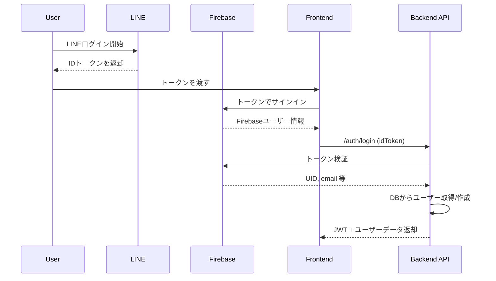
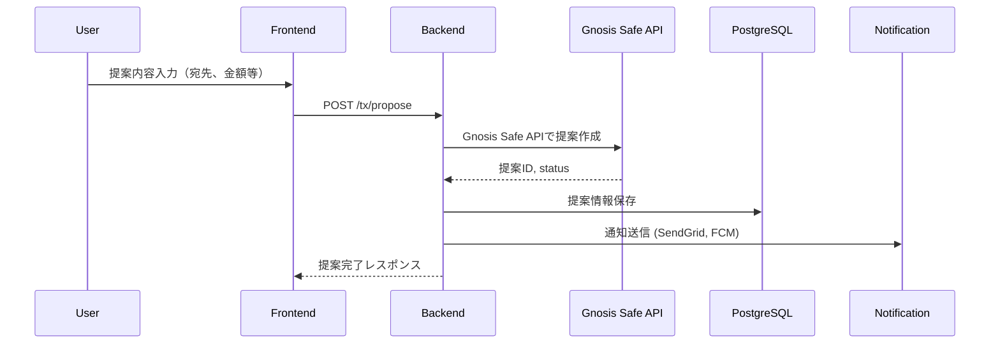
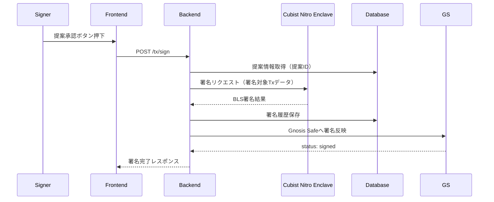
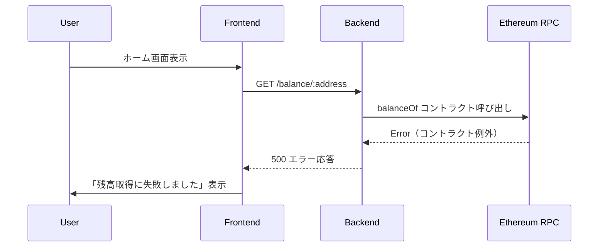

# シーケンス図設計（Sequence Diagram）

## 0. 本資料の位置づけ
- 本資料は、Unyte Wallet の主要な機能における処理の時系列的な流れ（システム間通信、ユーザー操作）を可視化するためのものです。
- バックエンド・フロントエンド・外部連携・ユーザー操作の整合性を担保します。

---

## 1. ログイン処理（LINE/Firebase）シーケンス図

---

## 2. トランザクション提案シーケンス図（Gnosis Safe連携）

---

## 3. 提案への署名処理シーケンス図（Cubist Enclave）

---

## 4. エラー発生時フロー例（残高取得失敗）

---

## 5. 今後追加予定のシーケンス図

| タイトル | 対応機能 | 状態 |
|----------|----------|------|
| 提案のキャンセル | F03 | 未作成 |
| マルチチェーン残高取得 | F02 | 設計中 |
| Admin操作ログの記録 | 内部運用 | 設計中 |

---

## 6. 関連資料

- [function-design.md](../basic/function-design.md)
- [api-specs](./api-specs)
- [architecture.md](../basic/architecture.md)
